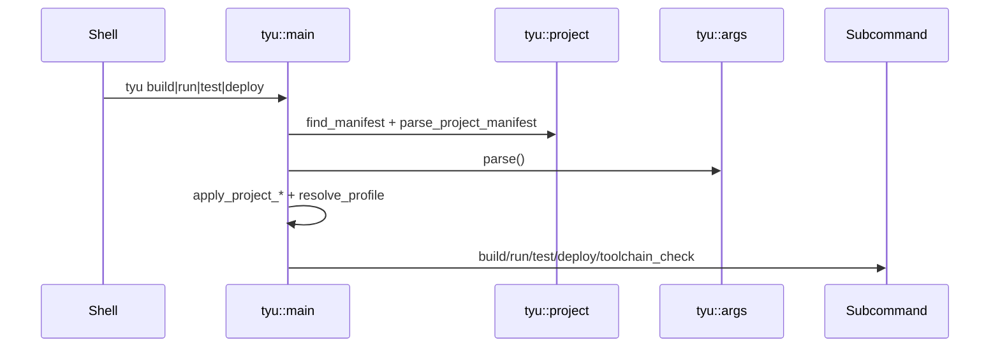
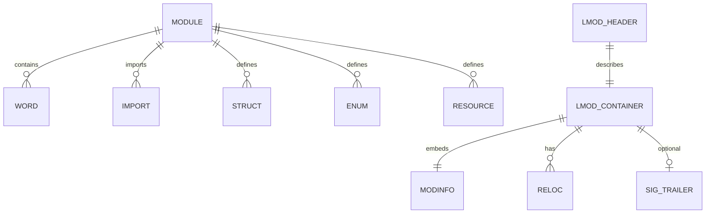

# Developer Documentation

## 1. Executive Summary

Tyu is a concatenative, stack-based systems language and toolchain for embedded and simulation targets. This repository contains the compiler front end, semantic checker, IR, target-specific code generators, module packer/signing/encryption tools, loader/runtime support, and the `tyu` project driver that orchestrates build, run, test, and deploy workflows.

It solves a fairly specific problem: building small, verifiable system images from `.mod` sources, linking them with a target runtime, packaging them into `.lmod` containers, and then loading or executing them under a trust model that can range from fully trusted firmware to re-derived untrusted modules.

Main consumers:
- Language/runtime developers working on the compiler, loader, or semantics.
- Embedded engineers building images for x86_64, ARM Cortex-M3, or RISC-V 32-bit targets.
- Test and CI authors maintaining the corpus and integration suites.
- Tooling integrators who need to extend the loader, runner, or deployment path.

What a new developer should learn first:
- `tyu` is the orchestrator, `langc` is the compiler, and the `lmod-*` binaries are post-processing helpers.
- `frontend` parses source, `semantics` typechecks and lowers to IR, `ir` defines the load-bearing representation, and `codegen-*` backends emit target code.
- Targets, features, and trust tiers are distinct concepts. A target triple is not the same as a feature profile or a loader trust level.
- The runtime boundary is encoded in the module ABI hash. Changing layout, runtime ABI, or module metadata invalidates previously built modules.

Big gotchas:
- `--emit=asm` in `langc` is inspection-only; `--emit=obj` is the production path.
- `tyu` defaults to `x86_64-unknown-linux-gnu` if no target is provided in common paths.
- The loader’s trust tier defaults to Tier 0, and at that tier signature verification is effectively trust-unconditionally in the platform abstraction.
- `tyu` build caching is fingerprint-based; changes to the compiler binary mtime and `CODEGEN_REV` intentionally invalidate cached objects.
- There is a visible versioning inconsistency in the codebase: `crates/lmod/src/modinfo.rs` sets `MODINFO_VER = 2`, while `crates/lmod/src/abi_hash.rs` tests/comments still reference `3`. I did not reconcile that mismatch here; treat it as a compatibility risk until verified.

## 2. High-Level Architecture

The repository is a modular monorepo with a layered compilation and deployment pipeline.

Major layers:
- `frontend`: tokenization, parsing, AST structures, spans, and syntax recovery.
- `semantics`: typechecking, effect/capability checking, resource and borrow analysis, MMIO validation, and IR generation.
- `ir`: the intermediate representation and contract types shared by compiler and backends.
- `codegen-core`: target descriptions, feature/target metadata, backend traits, and shared codegen errors.
- `codegen-x86_64`, `codegen-arm`, `codegen-riscv`: ISA-specific code generators.
- `langc`: the single-module compiler CLI and driver.
- `lmod`: `.lmod` container/header/modinfo/signature/encryption data structures and codecs.
- `lmod-pack`, `lmod-sign`, `lmod-encrypt`: container post-processing helpers.
- `loader-core`: the target-independent loader algorithm and platform abstraction.
- `hosted`: host-side runtime glue, loader platform implementation, and host wrappers.
- `harness-core`: execution-output parsing and ELF high-water scanning shared by `tyu` and test suites.
- `tyu`: project-level build/run/test/deploy driver.

Main runtime processes:
- `langc` compiles one module to AST/IR/assembly/object output.
- `tyu build` compiles a module graph, assembles runtime units, and links an image.
- `tyu run` builds and executes an image, then classifies the result from harness output.
- `tyu test` discovers fixtures, builds the right artifacts, runs them across one or more targets, and checks corpus expectations.
- `tyu deploy` builds, packs, optionally encrypts/signs, and runs the deploy artifact pipeline.
- `lmod-pack`, `lmod-sign`, and `lmod-encrypt` are standalone utilities for the packaging stage.
- `lang-assemble` is a wrapper around assembler invocation; it is partially implemented for FASM and returns explicit diagnostics for unsupported backends.

Data flow:
1. `.mod` or `.def` source is parsed into an AST.
2. Semantic analysis turns source into typed IR and verifies stack/effect/borrow/contract constraints.
3. Target backends lower IR to assembly or object code.
4. `lmod-pack` converts object code into `.lmod`.
5. `lmod-sign` appends a signature trailer.
6. `lmod-encrypt` optionally encrypts payload sections.
7. `loader-core` validates, verifies, relocates, and maps the container.
8. `tyu` and `harness-core` interpret execution output and diagnostics.

Architectural style:
- Modular monolith with strong internal layering.
- `no_std` core crates for portability.
- Host-side orchestration and tooling around the core compiler/runtime.
- Clear separation between “inspection” outputs and “production” outputs.
- The module ABI is an explicit contract boundary.

Intentional vs accidental structure:
- Intentional: target metadata lives in `TargetSpec`; compiler backends are selected through a trait; loader trust tiers are explicit; runtime units are target-specific assembly files.
- Intentional: the repository uses fixed capacities (`FixedVec`) and `no_std` in core crates to keep allocations and runtime dependencies controlled.
- Likely accidental/legacy: the parser still contains migration handling for older syntax forms; some test guards and comments reference old phases and stale version numbers.

```mermaid
flowchart LR
  A[.mod / .def] --> B[frontend]
  B --> C[semantics]
  C --> D[ir]
  D --> E[codegen-core]
  E --> F[codegen-x86_64 / arm / riscv]
  F --> G[object .o]
  G --> H[lmod-pack]
  H --> I[.lmod]
  I --> J[lmod-sign / lmod-encrypt]
  J --> K[loader-core]
  K --> L[hosted runtime / device]
  L --> M[harness-core / tyu output parsing]
```



## 3. Repository Map

| Path | Purpose | Important Notes |
|---|---|---|
| `Cargo.toml` | Workspace manifest | Declares all crates. Dev/test behavior is controlled at the workspace level. |
| `README.md` | Front door summary | Points to the tracked docs and lists the main build prerequisites. |
| `docs/DOCS.md` | Documentation index | Treat this as the tracked docs map. Add new docs here. |
| `docs/SETUP.md` | Setup and local development | Mirrors the actual CI/tooling commands. |
| `docs/TROUBLESHOOTING.md` | Known failure modes | Good reference for loader, diagnostic, and toolchain failures. |
| `docs/LIMITATIONS.md` | Known gaps and risks | Records visible debt, including ignored tests and trust-model caveats. |
| `docs/GLOSSARY.md` | Shared vocabulary | Useful for matching parser/IR/loader terminology. |
| `ci-lint.sh` | Test lint gate | Enforces test-quality conventions and a few repository-specific invariants. |
| `ci/guards.sh` | Test delivery gate | Checks that crates with `#[test]` actually execute tests. |
| `rust-toolchain.toml` | Toolchain pin | Stable Rust is required. |
| `runtime/` | Per-target runtime assembly/link scripts | Target-specific runtime units are assembled and linked by `tyu build`. |
| `sysroot/` | Standard library sources | Used by the compiler and test suites as the language sysroot. |
| `test-goldens/` | Checked-in artifact goldens | Used for binary and assembly golden tests. |
| `memory/` | Design notes / memory-model docs | Not part of the main build pipeline, but useful as background. |
| `crates/frontend` | Lexer/parser/AST | Source of truth for syntax and declaration forms. |
| `crates/semantics` | Typechecker and IR generation | Encodes the language’s safety model, resource model, and stack discipline. |
| `crates/ir` | IR and contracts | Shared between semantics and code generators. |
| `crates/codegen-core` | Target metadata and backend traits | Central place for target selection and codegen constraints. |
| `crates/codegen-x86_64` | x86_64 backend | Emits x86_64 assembly/object logic. |
| `crates/codegen-arm` | ARM backend | Emits ARM Thumb code for Cortex-M style targets. |
| `crates/codegen-riscv` | RISC-V backend | Emits RV32 code for bare-metal targets. |
| `crates/langc` | Compiler CLI | Single-module compiler driver and `langc` binary. |
| `crates/loader-core` | Loader algorithm | Core `.lmod` loader and platform abstraction. |
| `crates/lmod` | `.lmod` format | Header, modinfo, relocations, signatures, encryption, and validation. |
| `crates/lmod-pack` | Packager CLI | Converts object files to `.lmod`. |
| `crates/lmod-sign` | Signing CLI/library | Appends HMAC-SHA256 trailers. |
| `crates/lmod-encrypt` | Encryption CLI/library | Encrypts payload sections with ChaCha20-Poly1305. |
| `crates/hosted` | Host-side runtime glue | Implements `LoaderPlatform` on Linux/x86_64 and provides helper wrappers. |
| `crates/hosted-rt` | Startup/runtime entry macro support | Used by `langc` and `lang-assemble` no_std binaries. |
| `crates/harness-core` | Shared harness logic | Parses execution output and re-derives high-water bounds. |
| `crates/rsp-client` | GDB Remote Serial Protocol client | Used by debug escalation against QEMU gdbstub. |
| `crates/tyu` | Build/test/deploy orchestrator | The main entry point for project-level workflows. |
| `crates/lang-assemble` | Assembler wrapper | Thin CLI around assembler invocation. |
| `crates/execution-tests` | End-to-end execution tests | Runs target-specific assembly/QEMU suites. |
| `crates/tooling-tests` | Corpus-driven tooling tests | Verifies diagnostics, effects, encryption, loader behavior, and corpus expectations. |
| `Arith.asm` | Unknown/legacy root assembly file | The repository does not clearly document its role. Treat as unresolved. |

## 4. Core Concepts and Domain Model

### Module
Plain-English: a compilation unit. Source modules are `.mod`; interface-only modules are `.def`.

Implemented in:
- `crates/frontend/src/parse/mod.rs`
- `crates/frontend/src/parse/ast.rs`
- `crates/langc/src/iface.rs`
- `crates/tyu/src/graph.rs`

Relations:
- Modules contain imports, declarations, and exports.
- `langc` can compile a module alone, while `tyu` resolves a module graph rooted at a main module.

Example:
- `frontend::parse::ModuleAst` is the parsed representation.
- `tyu::graph::resolve_graph()` topologically sorts modules before build.

### Word
Plain-English: a named stack transformer with a signature, effects, required capabilities, and a stack bound.

Implemented in:
- `crates/frontend/src/parse/decl.rs`
- `crates/semantics/src/types.rs`
- `crates/ir/src/lib.rs`

Relations:
- Parsed `DeclAst` becomes `WordEntry` in the semantic environment and then `ir::Word`.
- Words can be imported, exported, or generated from builtins.

Example:
- `WordSig` contains up to 8 inputs and 8 outputs.
- `WordEntry` adds `performs`, `requires`, and `bound`.

### Signature
Plain-English: a typed stack effect of the form `inputs -- outputs`.

Implemented in:
- `crates/semantics/src/types.rs`
- `crates/semantics/src/typecheck/parse.rs`
- `crates/semantics/src/typecheck/mod.rs`

Relations:
- Signatures are parsed from source spans and become the basis for typechecking and codegen.
- The parser accepts type atoms and composed forms such as pointer and array-like constructs.

### Effects, capabilities, and context
Plain-English: effects describe what a word does; capabilities are grants required to do it; context frames model the ambient environment during checking.

Implemented in:
- `crates/ir/src/contract.rs`
- `crates/semantics/src/typecheck/context.rs`
- `crates/semantics/src/typecheck/error.rs`

Relations:
- `EffectSet` and `CapSet` are bitsets in the IR contract.
- `ContextStack` folds context frames to decide if a word is legal under the current environment.
- The context matrix in `context.rs` is the normative row-based model used by tests.

### Type atoms
Plain-English: fixed-size type names and compound type expressions encoded as atoms.

Implemented in:
- `crates/semantics/src/types.rs`
- `crates/ir/src/lib.rs`

Relations:
- Builtins such as `i64`, `bool`, `ptr`, `ptr_mut`, `mmio`, `quot`, `resource`, and `scoped` are predeclared atoms.
- The parser and typechecker treat these as canonical names.

### Target / TargetSpec / FeatureSet
Plain-English: target triples control ABI, assembler, linker, and runtime behavior; features control image-level capabilities such as concurrency and module loading.

Implemented in:
- `crates/codegen-core/src/target.rs`
- `crates/codegen-core/src/emit_mode.rs`
- `crates/tyu/src/project.rs`

Relations:
- `TargetSpec` is the single source of truth for slot width, calling convention, assembler, linker, QEMU invocation, and capabilities.
- `FeatureSet` comes from `tyu.toml` profiles or `langc --features=...`.

### StackBound
Plain-English: the net and peak stack usage of a word or module.

Implemented in:
- `crates/ir/src/contract.rs`
- `crates/loader-core/src/rederive.rs`
- `crates/diag-core/src/decode.rs`

Relations:
- `StackBound { net, high }` is used by the semantics checker and loader verification.
- `High::Top` means the bound is not finitely derivable.

### ABI hash
Plain-English: a compatibility checksum that prevents loading modules compiled against a different runtime contract.

Implemented in:
- `crates/lmod/src/abi_hash.rs`
- `crates/lmod/src/modinfo.rs`
- `crates/loader-core/src/load.rs`

Relations:
- It depends on slot width, word width, runtime ABI version, modinfo version, and the hash recipe version.
- `langc` and `tyu build` both compute it using the target spec.

### `.lmod` container
Plain-English: the deployable unit that packages module code, metadata, relocation information, and optional signature/encryption data.

Implemented in:
- `crates/lmod/src/header.rs`
- `crates/lmod/src/modinfo.rs`
- `crates/lmod/src/reloc.rs`
- `crates/lmod/src/validate.rs`
- `crates/lmod/src/sig.rs`
- `crates/lmod/src/enc.rs`

Relations:
- `lmod-pack` creates it from an ELF object.
- `lmod-sign` appends a trailer.
- `lmod-encrypt` adds an encryption envelope.
- `loader-core` validates and loads it.

### Trust tier
Plain-English: a module loading policy that controls how much the loader trusts incoming modules.

Implemented in:
- `crates/loader-core/src/platform.rs`
- `crates/loader-core/src/load.rs`

Relations:
- Tier 0 trusts the platform baseline.
- Tier 1 requires per-module signature checks.
- Tier 2 requires stronger re-derivation and untrusted-module handling.

## 5. Application Flow and Request Lifecycle

### Startup / initialization
Triggered by:
- `tyu` process startup.
- `langc` process startup via `hosted_rt::entry!`.

What happens:
1. `tyu::main()` reads the current directory and tries to find `tyu.toml`.
2. The manifest is parsed into `ProjectManifest`.
3. CLI arguments are parsed into `args::Command`.
4. Project settings are merged into the command-specific args.
5. The selected subcommand runs.

Failure points:
- Missing or invalid `tyu.toml`.
- Unknown target triple.
- Invalid profile or feature name.

Debugging:
- Run `tyu toolchain check <target>`.
- Print the resolved manifest with `eprintln!` output from `tyu main`.



### Build pipeline
Triggered by:
- `tyu build`
- `tyu run` and `tyu deploy` call into the same build pipeline first.

What happens:
1. Resolve the module graph with `tyu::graph::resolve_graph`.
2. Compute the target ABI hash using `lmod::abi_hash::compute_abi_hash`.
3. Load the build cache (`target/tyu/build.json`).
4. Compile each module with `langc`.
5. Assemble required runtime units from `runtime/<triple>`.
6. Link the resulting object files into an ELF image.
7. Persist the build cache.

Failure points:
- Graph resolution failures and cycles.
- Missing tools on PATH.
- `langc` compilation failure.
- Runtime unit missing for the selected target.
- Linker or assembler failure.

Debugging:
- Inspect `target/tyu/<triple>/build.json`.
- Use `langc --emit=ir` or `--emit=asm` to narrow down where the compiler diverges.

### Main request handling path for `langc`
Triggered by:
- Running the `langc` binary directly.

What happens:
1. Parse CLI flags in `crates/langc/src/args.rs`.
2. Read source bytes and parse the module AST.
3. Resolve imports and interfaces in `iface.rs`.
4. Build the semantic environment and check the module.
5. Emit AST, IR, stackcheck output, assembly, or object code depending on `EmitMode`.

Failure points:
- Parse errors, missing input, invalid emit mode, or `--emit=obj` without `--target`.
- Semantic/typecheck errors.
- Backend unsupported-op or malformed-output errors.

### Run / execution lifecycle
Triggered by:
- `tyu run`
- `tyu test`

What happens:
1. Build the image.
2. Select a runner:
   - native host execution,
   - QEMU system-mode,
   - QEMU gdbstub escalation,
   - or device runner via OpenOCD.
3. Execute the image with a timeout.
4. Parse stdout/stderr markers via `harness_core::parse_output`.
5. Classify results as hang, no completion, failure marker, or exit-code mismatch.

Failure points:
- Runner selection mismatch.
- Missing QEMU or native execution environment.
- Missing `S`, `F`, `H`, `P`, or `D` markers.
- Exit code mismatch for the platform’s expected pass convention.

### Background job execution
The repository does not have a general-purpose async worker queue. Background-ish work happens via:
- `tyu build` compiling modules and runtime units.
- `tyu test` iterating fixtures and targets.
- `tyu debug_escalate` attaching to QEMU gdbstub when diagnostics are missing.

### Event handling / diagnostics
Events are mostly execution-output records:
- `F` failure marker.
- `S` completion marker.
- `H` high-water marker.
- `P` assertion count marker.
- `D` diagnostic record.

These are parsed in `harness-core` and fed into the test and escalation flows.

### Data persistence
Persistent outputs:
- `target/tyu/build.json` build cache.
- produced `.o`, `.lmod`, and image artifacts in `out_dir`.
- test goldens and corpus fixtures in the repo.

### Error handling
The codebase uses explicit error enums and stable numeric codes across major surfaces:
- `TyuError`
- `CodegenError`
- `TcError`
- `LoadError`
- `PackError`, `SignError`, `EncError`

Most user-facing commands print a diagnostic to stderr and exit non-zero rather than bubbling panics.

### Logging and observability
Logging is mostly stderr text with a few structured diagnostics:
- `langc` emits parsed error codes via `diag::error_simple`.
- `tyu` prints manifest selection, profile resolution, and execution outcome summaries.
- test corpus and escalation paths emit detailed diagnostic comparisons.

### External service calls
- `tyu` shells out to assemblers, linkers, QEMU, and OpenOCD.
- `debug_escalate` connects to QEMU’s gdbstub using the RSP client.

### Shutdown / cleanup
- `tyu clean` removes `target/tyu`.
- Runner processes are terminated by timeout or completion logic.

## 6. Public APIs and Interfaces

### CLI binaries

| Command | Purpose | Location | Inputs | Output | Notes |
|---|---|---|---|---|---|
| `langc` | Compile a single module | `crates/langc/src/main.rs` | Source file, flags from `crates/langc/src/args.rs` | AST/IR/asm/object/stdout diagnostics | `no_std`, `no_main`, hosted entry macro. |
| `tyu` | Project driver | `crates/tyu/src/main.rs` | Subcommands `build`, `run`, `test`, `deploy`, `toolchain check`, `clean` | Build outputs, execution results, toolchain report | The main orchestration interface. |
| `lmod-pack` | Pack ELF object to `.lmod` | `crates/lmod-pack/src/main.rs` | Input `.o`, output `.lmod` | Packed container | Uses `lmod_pack::pack`. |
| `lmod-sign` | Append HMAC signature | `crates/lmod-sign/src/main.rs` | Input `.lmod`, output `.lmod`, `--key=<hex>` | Signed container | Requires 32-byte key. |
| `lmod-encrypt` | Encrypt payload sections | `crates/lmod-encrypt/src/main.rs` | Input `.lmod`, output `.lmod`, mode-specific key material | Encrypted container | Supports fleet/device modes. |
| `lang-assemble` | Assembler wrapper | `crates/lang-assemble/src/main.rs` | Assembly input, output path, target | Object file or diagnostic | FASM is implemented; GAS backends report unsupported. |

### `tyu` subcommands

| Method | Path | Purpose | Auth | Request | Response | Implementation |
|---|---|---|---|---|---|---|
| `build` | `tyu build` | Compile/link an image | None | `--target`, `--profile`, `--sysroot`, `--out-dir`, `-I` | Path to image | `crates/tyu/src/build.rs` |
| `run` | `tyu run` | Build and execute an image | None | Build args + `--timeout`, `--runner` | Exit classification, stdout parsing | `crates/tyu/src/run_cmd.rs` |
| `test` | `tyu test` | Discover and run fixtures | None | `--target`, `--all-targets`, `--filter`, `--manifest` | Per-fixture result reporting | `crates/tyu/src/test_cmd.rs` |
| `deploy` | `tyu deploy` | Build, pack, encrypt, sign, and execute | None, but key material required for secure modes | Build args + encrypt/sign/device options | Deploy artifacts and verification summary | `crates/tyu/src/deploy.rs` |
| `toolchain check` | `tyu toolchain check <target>` | Resolve compiler/tool paths | None | Target alias or triple | Human-readable tool report | `crates/tyu/src/toolchain.rs` |

### Core traits and internal interfaces

| Interface | Location | Purpose | Extension Guidance |
|---|---|---|---|
| `CodegenBackend` | `crates/codegen-core/src/backend.rs` | Target backend contract | Implement for a new ISA/backend pair. |
| `LoaderPlatform` | `crates/loader-core/src/platform.rs` | Platform abstraction for memory allocation and verification | Implement for a new runtime/host/device. |
| `Output` | `crates/frontend/src/parse/ast.rs` and `semantics` re-exports | Text output sink for parsers/emitters | Use for inspection output. |
| `TypecheckObserver` | `crates/semantics/src/typecheck/irgen/observer.rs` | Inspect typechecker/IR-gen events | Use to observe or test typechecking. |
| `Runner` | `crates/tyu/src/runner.rs` | Execution backend selector | Add new execution modes here. |

### `langc` compiler flags
- `--emit=ast|ir|tc|asm|obj`
- `--lib`
- `-g`
- `-I <path>`
- `--checks=off|contracts|all`
- `--allow-raw-casts`
- `--features=<csv>`
- `--no-default-features`
- `--sysroot=<path>`
- `--out-dir=<path>`
- `--target=<triple>`

### `tyu` command-line options
- `--target=<triple>`
- `--profile=<name>`
- `--sysroot=<dir>`
- `--out-dir=<dir>`
- `-I <dir>`
- `--timeout=<secs>`
- `--runner=native|qemu`
- `--all-targets`
- `--filter=<pat>`
- `--manifest=<path>`
- `--encrypt=none|fleet|device`
- `--key-encrypt=<ref>`
- `--key-sign=<ref>`
- `--device-keys=<dir>`
- `--sign`

## 7. Configuration and Environment

Config files:
- `rust-toolchain.toml`
- `tyu.toml` project manifests
- `fixtures/manifest.toml` as the default test-manifest path for `tyu test`

Environment variables:

| Name | Required | Default | Used By | Description |
|---|---:|---|---|---|
| `TYU_BIN_DIR` | No | none | `tyu` tests and integration helpers | Points to a directory containing built host binaries. |
| `TYU_<ROLE>_<TRIPLE>` | No | none | `tyu::toolchain` | Overrides a specific tool for a target triple. |
| `PATH` | Yes in practice | system PATH | `tyu`, host tools, tests | Used to resolve assemblers, linkers, QEMU, OpenOCD, and `langc`. |
| `CI` | No | unset | tests/guards | Changes missing-tool behavior from skip to hard failure in some suites. |
| `TYU_TEST_KEY` | No | test-only | `crates/tyu/src/keys.rs` tests | Demonstrates safe env-based key loading. |

Project manifest sections:
- `[project]`: main module and module roots.
- `[targets.<name>]`: alias to a target triple plus optional runner.
- `[toolchain.<triple>]`: assembler, linker, and QEMU overrides.
- `[deploy.<name>]`: deployment settings.
- `[profile.<name>]`: feature lists (`concurrency`, `module-loading`).

Defaulting rules:
- `tyu` build/run defaults to `x86_64-unknown-linux-gnu` if no target is provided.
- `tyu test` defaults to `fixtures/manifest.toml`.
- `tyu` build/run output defaults to `target/tyu/<triple>`.
- If no `profile` is set and a manifest contains `[profile.dev]`, that profile is used; otherwise the feature set defaults to all enabled in `tyu`.
- `langc` defaults to `FeatureSet::all()` unless overridden by flags or project resolution.

Dangerous values:
- Changing target slot width, target ABI, or `MODINFO_VER` invalidates cached and prebuilt artifacts.
- Changing trust-tier assumptions alters signature verification behavior.
- Changing runtime assembly paths or toolchain overrides affects the whole build pipeline.

## 8. Data Model and Persistence

This repository does not use a general-purpose database. Its persistence model is file-based.

Stored artifacts:
- `.mod` and `.def` source files.
- `.o` intermediate objects produced by `langc`.
- `.lmod` containers produced by `lmod-pack`, `lmod-sign`, and `lmod-encrypt`.
- `target/tyu/build.json` build cache.
- `test-goldens/*.lmod` and `test-goldens/asm/*` golden outputs.

Major structured formats:
- `frontend::parse::ModuleAst` captures module syntax.
- `ir::Module`, `ir::Word`, `ir::Block`, and `ir::Op` capture compiler IR.
- `lmod::header::LmodHeader` captures container layout.
- `lmod::modinfo::LangModInfo` encodes exported/imported symbol metadata and resource metadata.
- `loader-core::symbols::SymMap` tracks exported names at load time.
- `tyu::cache::BuildCache` persists compiler artifact fingerprints and object paths.

Relationships:
- A module contains words, imports, structs, enums, subtypes, resources, and metadata.
- The container header points to `modinfo`, code, rodata, data, relocation, and signature regions.
- The loader binds exports into a flat symbol map and prevents duplicate names and hash collisions.



Important constraints:
- `lmod::validate::Container::parse()` rejects malformed containers before accessors can be used.
- `tyu::cache::BuildCache` version `2` is the only recognized cache schema; unreadable or wrong-version files are treated as empty.
- `SymMap` is fixed-capacity and O(n) lookup by design; that is acceptable for small embedded symbol counts.

## 9. External Services and Integrations

| Service | Purpose | Code Location | Config | Failure Handling |
|---|---|---|---|---|
| `fasm` | Assemble x86_64 runtime and objects | `crates/tyu/src/build.rs`, `crates/lang-assemble/src/driver.rs` | PATH or `tyu.toml` toolchain override | Hard error if missing or non-zero exit. |
| `arm-none-eabi-as` / `arm-none-eabi-ld` | ARM bare-metal assembly/linking | `crates/tyu/src/build.rs` | PATH or `[toolchain.<triple>]` | Hard error. |
| `riscv64-unknown-elf-as` / `riscv64-unknown-elf-ld` | RISC-V bare-metal assembly/linking | `crates/tyu/src/build.rs` | PATH or `[toolchain.<triple>]` | Hard error. |
| `ld` | Hosted x86_64 linking | `crates/tyu/src/build.rs` | PATH or manifest override | Hard error. |
| `qemu-system-x86_64`, `qemu-system-arm`, `qemu-system-riscv32` | Execution backend for tests and run modes | `crates/tyu/src/runner.rs`, `crates/execution-tests/tests/*` | PATH or toolchain override | Timeout, exit-code mismatch, or skip when unavailable outside CI. |
| `OpenOCD` | Physical device flashing | `crates/tyu/src/runner.rs` | Runner configuration | Flash failure becomes a `TyuError::Runner`/build error. |
| QEMU gdbstub | A-side escalation debugging | `crates/tyu/src/debug_escalate.rs` | QEMU `-gdb`/`-S` flow | Escalation returns a diagnostic string or an error string. |
| Host OS syscalls (`mmap`, `mprotect`, `munmap`) | Host loader memory management | `crates/hosted/src/loader.rs` | Platform implementation | Wrapped into loader error codes. |
| RSP over TCP | Debugger transport | `crates/rsp-client/src/lib.rs` | Ephemeral local TCP port | Connection/packet failures are returned as I/O errors. |

How to test integrations locally:
- Use `tyu toolchain check <target>` to verify tool discovery.
- Use `cargo test -p rsp-client` and `cargo test -p loader-core` for lower-level behavior.
- Use `tyu run --runner=native` or `--runner=qemu` to isolate execution backends.
- Use the `execution-tests` and `tooling-tests` suites for end-to-end validation.

## 10. Building Applications on Top of This Codebase

Intended extension points:
- Add a new target by extending `codegen-core::Target` and adding a backend.
- Add a new semantic check in `semantics`.
- Add a new runtime service by adding a runtime assembly unit and exposing it through `TargetSpec::Feature`.
- Add a new loader capability by extending `LoaderPlatform` or the loader data model.
- Add a new orchestrated workflow in `tyu`.

What to use instead of modifying internals:
- Use `TargetSpec` instead of ad hoc `if target == ...` checks.
- Use `CodegenBackend` instead of emitting assembly from the driver.
- Use `LoaderPlatform` instead of hardcoding `mmap`/`mprotect`.
- Use `BuildCache` and `tyu::graph::resolve_graph()` rather than reinventing build discovery.

### How-to 1: Add a new `tyu` subcommand

Goal:
- Add a command such as `tyu inspect`.

Files to modify:
- `crates/tyu/src/args.rs`
- `crates/tyu/src/main.rs`
- New module under `crates/tyu/src/`

Steps:
1. Add a new variant to `args::Command`.
2. Extend `parse()` with a new branch.
3. Add a new command module and call it from `main.rs`.
4. Decide whether the command needs project manifest resolution or profile resolution.
5. Add tests in `crates/tyu/tests/`.

Example:
```rust
// args.rs
pub enum Command {
    // ...
    Inspect(InspectArgs),
}
```

Tests to add:
- CLI parse test.
- Failure mode test for missing required flags.
- Integration test if the command shells out.

Common mistakes:
- Forgetting to update `print_usage()`.
- Returning `String` errors in new code when `TyuError` is already available.

### How-to 2: Add a new target backend

Goal:
- Support a new architecture or platform.

Files to modify:
- `crates/codegen-core/src/target.rs`
- New backend crate under `crates/`
- `crates/langc/src/driver.rs`
- `crates/tyu/src/build.rs`
- Runtime assembly under `runtime/<triple>/`

Steps:
1. Add a new `Target` variant and `TargetSpec`.
2. Add assembler/linker/QEMU metadata and capabilities.
3. Implement `CodegenBackend` for the ISA.
4. Teach `langc` to select the new backend.
5. Add runtime assembly and linker scripts.
6. Add loader/runner support if it is a new execution model.

Tests to add:
- Backend unit tests.
- Golden assembly/object tests.
- End-to-end `tyu run`/`tyu test` coverage.

Common mistakes:
- Forgetting to update `Target::ALL`.
- Forgetting to extend `tyu` target-specific tool requirements.
- Diverging the ABI hash by changing target contract fields without updating goldens.

### How-to 3: Add a new language feature or builtin word

Goal:
- Add a new word, type atom, or syntax form.

Files to modify:
- `crates/frontend/src/parse/decl.rs`
- `crates/semantics/src/typecheck/builtins.rs`
- `crates/semantics/src/typecheck/irgen/*`
- `crates/ir/src/lib.rs` and/or `crates/ir/src/contract.rs`
- Tests in `crates/frontend/tests/` and `crates/semantics/tests/`

Steps:
1. Add syntax support in the parser.
2. Extend the semantic environment or builtin table.
3. Lower the construct to IR.
4. Add backend support if the IR op is new.
5. Add corpus coverage or golden tests.

Tests to add:
- Parse success/failure tests.
- Semantics acceptance/rejection tests.
- Backend output tests if codegen changes.

Common mistakes:
- Adding a parser form without a corresponding semantic rule.
- Updating the parser but forgetting the tests that lock in error codes.

### How-to 4: Add a new external integration

Goal:
- Integrate a new loader platform, runner, or debugging backend.

Files to modify:
- `crates/loader-core/src/platform.rs`
- `crates/tyu/src/runner.rs`
- `crates/tyu/src/debug_escalate.rs`
- Possibly `crates/rsp-client`

Steps:
1. Define the abstraction boundary first.
2. Implement the concrete client or platform.
3. Return stable error codes or structured errors.
4. Add a test harness that exercises both happy and failure paths.

## 11. API Usage Examples

### Minimal `langc`
```bash
langc --emit=ast src/Main.mod
```

### Authenticated / secure deployment example
```bash
tyu deploy \
  --target=x86_64-unknown-none \
  --encrypt=fleet \
  --key-encrypt=file:keys/fleet.kek \
  --key-sign=file:keys/signing.key \
  --sign \
  src/Main.mod
```

### Error-handling example
```bash
if ! tyu run --runner=qemu --timeout=15 src/Main.mod; then
  echo "run failed; inspect stderr diagnostics"
fi
```

### Advanced example
```bash
langc --emit=obj --target=armv7m-unknown-none \
  --sysroot=sysroot \
  --out-dir=target/tyu/armv7m-unknown-none \
  -I src \
  src/Main.mod
```

### Connecting to another service
- The closest thing to a service connection in this repo is the `LoaderPlatform` implementation in `hosted` or the RSP client used by `debug_escalate`.
- For example, a new debugger backend would implement a TCP client analogous to `rsp-client::RspClient` and then use it from a new escalation flow.

### Small feature example
- To add a new runtime unit, add a `runtime/<triple>/<unit>.asm` file, extend `Feature::runtime_unit()`, and let `tyu build` include it when the feature is enabled.

## 12. Extension and Customization Guide

Extension mechanisms:
- Rust traits: `CodegenBackend`, `LoaderPlatform`, and `TypecheckObserver`.
- Target registry: `Target`, `TargetSpec`, `Feature`, and `PlatformCapability`.
- Runtime units: target-specific `.asm` files under `runtime/`.
- Build manifest: `tyu.toml` profiles, toolchain overrides, and target aliases.
- Test corpus: add fixtures under `crates/tooling-tests/tests/corpus` or `crates/execution-tests/fixtures`.

Safe extension checklist:
- Preserve stable numeric error codes.
- Update tests before changing parser or ABI behavior.
- Keep `TargetSpec` authoritative; do not duplicate target constants in multiple crates.
- Decide whether a new feature changes semantics, runtime linkage, or both.
- Add loader/platform behavior only through `LoaderPlatform` or the loader container format, not via ad hoc host-side special cases.
- Validate new external tool dependencies in `tyu toolchain check`.

What should stay internal:
- `irgen` helper internals.
- `loader-core` relocation helpers.
- Parser recovery details.
- Test-only debug scaffolding.

How extensions are discovered and loaded:
- Build-time: by `tyu` graph resolution and runtime-unit inclusion.
- Compile-time: by Rust `mod` declarations and explicit crate dependencies.
- Runtime: by `LoaderPlatform` and the chosen runner.

How extensions can break the system:
- Invalidating ABI hash assumptions.
- Changing loader trust semantics without updating docs/tests.
- Introducing new IR ops without backend support.
- Adding runtime units without target metadata.

## 13. Important Design Principles

The codebase appears to follow these principles:
- Explicit contracts over implicit convention. Examples: `TargetSpec`, `StackBound`, `LoaderPlatform`, `CodegenBackend`.
- Small fixed-capacity data structures in core code to keep `no_std` friendliness and bound memory use.
- Compatibility-by-construction. ABI hash, modinfo, and loader error codes are all intentionally stable.
- Layered lowering pipeline. Each phase owns a single responsibility.
- Host tooling separated from core runtime semantics. The core crates avoid host-only assumptions.

Tradeoffs:
- The system favors predictability and explicitness over maximal flexibility.
- Fixed capacities make implementation simpler but impose hard ceilings on some structures.
- `tyu` uses shell-out orchestration rather than an in-process linker/assembler pipeline.
- The loader’s trust model is explicit but somewhat conservative and platform-specific.

Complexity intentionally hidden:
- ABI hash computation.
- Container validation and signature/encryption layout.
- QEMU debug escalation.
- Build graph resolution and cache invalidation.

High-coupling areas:
- Target metadata and runtime units.
- ABI hash, modinfo, and container layout.
- Typechecker, IR, and backend op support.

Low-coupling areas:
- CLI wrappers around helper crates.
- Corpus tests around explicit output records.

Repeated patterns:
- `Result<T, E>` with stable error codes.
- `FixedVec` plus explicit capacity checks.
- Trait-driven backends/platforms.
- `no_std` in core crates and `std` only where required.

Risky areas:
- Version bumps in `modinfo` / ABI hash / runtime ABI.
- Loader trust-tier behavior.
- Any new IR operation that must be classified everywhere.

## 14. Error Handling, Validation, and Edge Cases

Validation happens in several places:
- Parsing errors in `frontend`.
- Type/signature validation in `semantics`.
- Container structural checks in `lmod::validate::Container::parse`.
- Platform and trust checks in `loader-core`.
- CLI argument validation in `tyu` and `langc`.

Error types and patterns:
- Error enums with stable numeric codes are preferred.
- `diag::error_simple(code, msg)` is used for user-facing diagnostics.
- `thiserror` powers `TyuError` formatting.

How errors are returned:
- `langc` and `tyu` generally return exit code `2` for user-facing failures in compiler-like paths.
- `tyu run` uses specific exit codes for hang/no-completion/failure-marker/mismatch.
- Loader errors map to the `52xx` band.

Retry/recovery:
- Build cache misses are normal and recover by recompiling.
- Missing tools can be skipped outside CI in some tests.
- `debug_escalate` retries execution under gdbstub after missing in-guest diagnostics.

Explicit edge cases:
- Container bounds and overlap checks.
- Hash collisions in the global symbol map.
- Tool availability differences between local and CI runs.
- Test fixtures that are allowed to fail only in prescribed ways.

Under-tested or missing:
- The repository’s own docs note limited RISC-V end-to-end coverage and no tracked fuzzing harness.
- There is no visible HTTP/API layer, so network-edge validation is not a concern.

## 15. Authentication, Authorization, and Security

Authentication and authorization are not present in the usual web-app sense. The security model is loader- and key-centric.

Security mechanisms:
- Trusted container signatures and encryption envelopes.
- Trust tiers in the loader platform abstraction.
- Zeroized key material in `tyu::keys::KeyMaterial`.
- Key source parsing that rejects raw command-line hex keys and prefers `file:`, `env:`, or `fd:` references.

Where checks are enforced:
- `loader-core::load_module` enforces trust-tier and signature/encryption rules.
- `lmod::validate::Container::parse` enforces structural safety.
- `tyu::deploy` enforces key presence for fleet/device encryption and signing flows.

Secrets handling:
- `KeyMaterial` stores keys in a zeroizing buffer.
- `KeyRef` supports safe sources and rejects bare hex on the command line.

Main assumptions:
- Tier 0 trusts the platform by default.
- Tier 1 and 2 require stronger verification and/or re-derivation.
- The signed region and encrypted envelope layout are part of the compatibility contract.

Security-sensitive areas:
- Trust-tier defaults in `LoaderPlatform`.
- Encryption/signature trailer handling.
- Loader relocation and symbol resolution.
- QEMU gdbstub escalation, because it can expose execution state and symbols.

Obvious risks:
- A fail-open default at Tier 0 if a platform implementation does not override verification.
- Version mismatches between container format, modinfo, and ABI hash can silently reject old artifacts.

## 16. Testing Strategy

Test frameworks and styles:
- Standard Rust unit tests.
- Integration tests under crate-specific `tests/` directories.
- Corpus-driven end-to-end tests in `crates/tooling-tests`.
- Execution tests in `crates/execution-tests`.

Where tests live:
- `crates/frontend/tests/`
- `crates/semantics/tests/`
- `crates/ir/tests/`
- `crates/codegen-*/tests/`
- `crates/loader-core/src/*` unit tests
- `crates/tooling-tests/tests/`
- `crates/execution-tests/tests/`
- `crates/lmod-encrypt/tests/`

Patterns:
- Parser tests assert exact error variants and spans.
- Semantics tests assert IR shape, stack effects, and rejection codes.
- Corpus tests compare observed results to expected failure modes and diagnostic claims.
- `ci/guards.sh` ensures crates with `#[test]` actually execute tests.
- `ci-lint.sh` rejects some common test anti-patterns.

How to run tests locally:
```bash
cargo test --workspace --release
bash ci-lint.sh
bash ci/guards.sh
```

How to add tests for a new feature:
1. Add unit tests near the code you changed.
2. Add a corpus entry if the behavior is end-to-end.
3. Add a golden artifact if the output is stable and intended to remain stable.
4. Add a regression test for every loader/codegen error code you touch.

Well-tested areas:
- Parser error handling.
- Core loader error codes.
- ABI hash stability.
- Diagnostic corpus behavior.

Weaker areas:
- RISC-V end-to-end coverage.
- Exhaustive effect/context-cell oracle coverage.

## 17. Local Development Setup

Required tools:
- Stable Rust toolchain from `rust-toolchain.toml`.
- `fasm`
- `ld`
- `qemu-system-x86_64`
- `qemu-system-arm`
- `qemu-system-riscv32`
- Optional: `gcc-arm-none-eabi`, `gcc-riscv64-unknown-elf`
- `python3` for guard scripts

Install dependencies according to your platform package manager, then run:
```bash
cargo build --release -p langc -p tyu -p lmod-pack -p lmod-encrypt -p lmod-sign
cargo test --workspace --release
bash ci-lint.sh
bash ci/guards.sh
```

Common setup problems:
- Missing assembler/linker/QEMU binaries.
- Wrong target triple or missing sysroot path.
- `TYU_BIN_DIR` not pointing at built host binaries for integration tests.

Useful commands:
- `tyu toolchain check <target>`
- `tyu build ...`
- `tyu run ...`
- `tyu test ...`

## 18. Build, Release, and Deployment

Build system:
- Cargo workspace plus shell-based orchestration.

Artifacts:
- Compiler binaries: `langc`, `tyu`, `lmod-pack`, `lmod-sign`, `lmod-encrypt`.
- Object files in target output directories.
- ELF images for runtime execution.
- `.lmod` deployment bundles.

CI/CD:
- `ci-lint.sh`
- `ci/guards.sh`
- Workspace `cargo test` / `cargo build` commands referenced in docs.

Versioning:
- `CODEGEN_REV` invalidates build cache.
- `ABI_HASH_VER` and `RUNTIME_ABI_VERSION` protect the loader boundary.
- `FORMAT_VER` protects `.lmod` container compatibility.

Deployment path:
1. Build module graph and runtime.
2. Pack object to `.lmod`.
3. Optionally encrypt.
4. Optionally sign.
5. Run or distribute the final bundle.

Rollback assumptions:
- The repo does not show formal deployment rollback tooling.
- The loader rollback is transactional during load failure, not a full deployment rollback system.

## 19. Observability and Operations

Logging:
- Mostly stderr text and explicit diagnostics.
- `tyu` prints manifest usage, feature resolution, and outcome summaries.
- `langc` emits diagnostics through `diag-core`.

Metrics/traces:
- No explicit metrics system is evident in the codebase.
- No tracing backend is visible.

Health checks:
- Toolchain checks via `tyu toolchain check`.
- Corpus tests and guard scripts act as operational canaries.

Debugging production issues:
- For compile issues, use `langc --emit=ir` or `--emit=asm`.
- For load issues, inspect `LoadError` and `Container::parse`.
- For runtime failures, use `tyu run` plus gdbstub escalation.

Likely operational failure modes:
- Tool missing from PATH.
- QEMU or assembler mismatch.
- ABI/version mismatch.
- Trust-tier or signature mismatch.

## 20. Performance and Scalability

Likely bottlenecks:
- Repeated module compilation for large graphs.
- External assembler/linker invocations.
- QEMU execution and debug escalation.
- O(n) symbol lookup in the loader, although the symbol counts are expected to stay small.

Caching:
- `tyu::cache::BuildCache` avoids recompiling unchanged modules.
- Build fingerprints include compiler revision, compiler mtime, transitive dependency hashes, and ABI hash.

Batching/pagination/concurrency:
- Build graph resolution is topological.
- Test suites run over filtered fixtures and all supported targets.
- `tyu` does not appear to use a worker pool; orchestration is sequential.

Scale assumptions:
- Small embedded-style symbol counts.
- Fixed capacities for many compiler/runtime structures.
- External tool invocations dominate cost, not in-memory algorithmic complexity.

What would need to change to scale further:
- Parallelize module compilation.
- Replace fixed capacities with dynamically sized structures where needed.
- Improve cache invalidation granularity and artifact reuse.

## 21. Common Developer Tasks

### Add a new endpoint
There is no HTTP endpoint surface in this repository. If you mean a new command or API entry point, add it to `tyu`, `langc`, or a helper binary using the relevant CLI parser and driver module.

### Add a new config value
Goal:
- Introduce a new `tyu.toml` setting.

Files:
- `crates/tyu/src/project.rs`
- `crates/tyu/src/main.rs`
- `crates/tyu/src/args.rs`

Steps:
1. Add a field to the manifest struct.
2. Parse it from TOML with `serde`.
3. Thread it through the relevant args or build stage.
4. Add tests for default and explicit values.

### Add a new database migration
There is no database layer or migration system in the repository.

### Add a new service/client
Goal:
- Add a client for a new external tool, debugger, or platform.

Files:
- `crates/tyu/src/runner.rs`
- `crates/loader-core/src/platform.rs`
- `crates/rsp-client/src/lib.rs`

Steps:
1. Decide which abstraction boundary it belongs to.
2. Add a trait or wrapper if the tool is reusable.
3. Implement the process/network interaction.
4. Add integration tests and failure-mode checks.

### Add a new background job
There is no queue/worker system. Add it to `tyu` orchestration or to a new external process invocation.

### Add a new event/message type
If the message is an execution-output record, extend `harness-core`.
If the message is a loader diagnostic, extend `diag-core`.

### Add a new UI component or page
Not applicable. This repository has no web UI surface.

### Add a new CLI command
Use the `tyu` subcommand pattern described above.

### Add a new test
Pick the narrowest layer that captures the behavior:
- parser test for syntax
- semantics test for type/effect behavior
- loader test for container/load behavior
- corpus test for end-to-end regressions

### Debug a failing request
For compiler failures:
1. Run `langc --emit=ir`.
2. Compare the AST/IR with a passing fixture.
3. Check `semantics` error codes and spans.

For loader failures:
1. Inspect the `.lmod` with `Container::parse`.
2. Check signature/encryption flags.
3. Compare the computed ABI hash against the target spec.

### Debug a failed external integration
1. Run `tyu toolchain check <target>`.
2. Confirm the tool exists and is executable.
3. Reproduce the invocation with the exact command from the build/test code.

### Run only part of the system locally
Examples:
```bash
cargo test -p frontend
cargo test -p semantics
cargo test -p loader-core
tyu test --filter=corpus --manifest=fixtures/manifest.toml
```

## 22. Glossary

| Term | Definition | Where it appears | Why it matters |
|---|---|---|---|
| Module | A compilation unit, usually `.mod` | `frontend`, `langc`, `tyu` | The primary source artifact. |
| Word | A named stack transformer | `frontend`, `semantics`, `ir` | Core language abstraction. |
| Signature | Stack input/output list | `semantics`, `ir` | Drives typechecking and IR generation. |
| Effect | What a word does to runtime state | `ir::contract`, `semantics` | Controls safety and scheduling. |
| Capability | A required grant | `ir::contract`, `semantics` | Enforces context restrictions. |
| Context | Ambient checking environment | `semantics::typecheck::context` | Tracks nested grants/forbids. |
| Region | Allocation discipline | `semantics`, `codegen-*` | Replaces GC. |
| StackBound | Net and peak stack usage | `ir::contract`, `loader-core` | Enforced at compile/load time. |
| `abi_hash` | Compatibility checksum | `lmod`, `loader-core` | Prevents loading mismatched modules. |
| `.lmod` | Packaged module container | `lmod`, `loader-core` | Deployable artifact. |
| Loader | Authenticates and maps modules | `loader-core` | Runtime boundary. |
| Trust tier | Loader policy level | `loader-core::platform` | Determines signature enforcement. |
| FeatureSet | Build feature bitset | `codegen-core`, `tyu` | Selects runtime units and semantics. |
| TargetSpec | Per-target metadata | `codegen-core::target` | Single source of truth for target behavior. |
| `TYU_BIN_DIR` | Workspace-binary override | `tyu` tests | Keeps integration tests deterministic. |
| RSP | GDB remote serial protocol | `rsp-client` | Used for escalation debugging. |

## 23. Known Limitations and Risks

Confirmed limitations:
- Some tests are ignored; the docs note 15 ignored tests at the time of writing.
- RISC-V end-to-end coverage is thinner than x86_64 and ARM.
- There is no fuzzing harness tracked in the workspace.
- The effect/context matrix is a normative artifact, but not backed by a fully synthesized per-cell oracle.
- `lang-assemble` is not fully implemented for the GAS backends in the current code path.

Risks:
- ABI/version bumps can invalidate existing build artifacts and deployed modules.
- Trust-tier defaults can be misunderstood if a platform implementation leaves the default verification behavior in place.
- A lot of behavior depends on external tools, so local environment drift is a real operational risk.

Coupling and hidden dependencies:
- Runtime assembly file names and `Feature::runtime_unit()` must match.
- `TargetSpec` fields must remain consistent with loader/ABI expectations.
- The build cache key assumes the compiler binary mtime and `CODEGEN_REV` are enough to model compiler identity.

What should be refactored first:
- Reconcile the modinfo/ABI versioning mismatch.
- Continue reducing duplicated target/tool lookup logic.
- Consider a clearer strategy for scaling beyond fixed-capacity compiler structures.

## 24. Onboarding Path for New Developers

Read first:
1. `README.md`
2. `docs/GLOSSARY.md`
3. `docs/SETUP.md`
4. `docs/TROUBLESHOOTING.md`
5. `crates/codegen-core/src/target.rs`
6. `crates/tyu/src/main.rs`
7. `crates/langc/src/lib.rs`
8. `crates/lmod/src/header.rs`
9. `crates/loader-core/src/load.rs`

Recommended local commands:
```bash
bash ci-lint.sh
bash ci/guards.sh
cargo test --workspace --release
tyu toolchain check x86_64-unknown-linux-gnu
```

Starter task:
- Add a small parser or semantics test that exercises one current language construct and one failure case.

Concepts to understand before changing code:
- Target triples vs feature profiles.
- Module graph resolution.
- ABI hash and format versioning.
- The difference between inspection outputs and production outputs.

Mistakes to avoid:
- Editing runtime assumptions without updating loader/ABI tests.
- Adding a backend op without classifying it in every target.
- Assuming `tyu` is a generic package manager; it is a project driver for this language and repository only.

## 25. Appendix

### Full command reference
- `cargo build --release -p langc -p tyu -p lmod-pack -p lmod-encrypt -p lmod-sign`
- `cargo test --workspace --release`
- `bash ci-lint.sh`
- `bash ci/guards.sh`
- `tyu build`
- `tyu run`
- `tyu test`
- `tyu deploy`
- `tyu toolchain check <target>`
- `langc --emit=ast|ir|tc|asm|obj ...`
- `lmod-pack <input.o> <output.lmod>`
- `lmod-sign <input.lmod> <output.lmod> --key=<hex-key>`
- `lmod-encrypt <in.lmod> <out.lmod> --mode=fleet|device ...`

### Important file references
- `crates/tyu/src/main.rs`
- `crates/tyu/src/args.rs`
- `crates/tyu/src/build.rs`
- `crates/langc/src/lib.rs`
- `crates/semantics/src/typecheck/mod.rs`
- `crates/ir/src/lib.rs`
- `crates/codegen-core/src/target.rs`
- `crates/lmod/src/header.rs`
- `crates/lmod/src/modinfo.rs`
- `crates/loader-core/src/load.rs`
- `crates/hosted/src/loader.rs`
- `crates/harness-core/src/lib.rs`

### Relevant diagrams
- Architecture flow in section 2.
- Loader/test sequence flow in section 5.
- Entity relationship diagram in section 8.

### Existing docs in the repo
- `README.md`
- `docs/DOCS.md`
- `docs/SETUP.md`
- `docs/TROUBLESHOOTING.md`
- `docs/GLOSSARY.md`
- `docs/LIMITATIONS.md`
- `docs/CLEANUP.md`

### Unanswered questions
- Whether the `MODINFO_VER = 2` versus `3` discrepancy is an intentional transition or stale documentation/tests.
- The exact intent of the root `Arith.asm` file.
- Whether `lang-assemble` is meant to remain a thin wrapper or evolve into a first-class build step.

### Areas that need better documentation
- Exact target runtime symbol contracts.
- The full module-format-to-loader state machine.
- The relationship between the effect/context matrix and the corpus tests.
- The intended lifecycle of ignored tests and phase markers.
