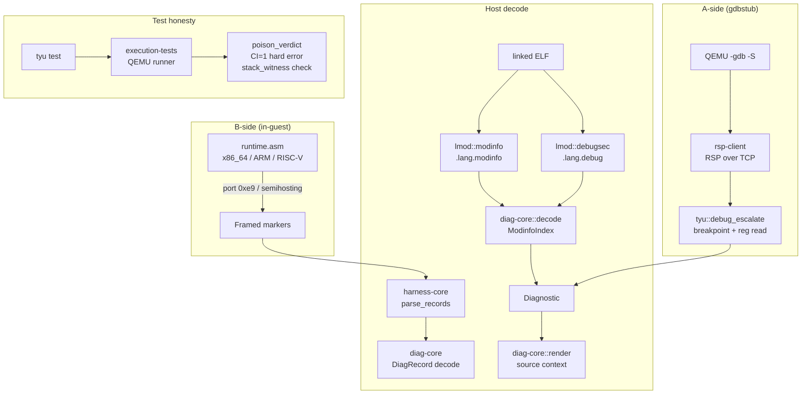

# Project Memory

## Runtime Debugger & Test-Honesty Remediation

**Status**: Phases 0–19 fully implemented.

### Architecture

### Key design documents

| Document | Location |
|---|---|
| Effect / Capability / Context Model | `devdocs/design-doc/effect-context-model.md` |
| Static Stack-Bound Analysis | `devdocs/design-doc/stack-bound-analysis.md` |
| Module Format & Loading | `devdocs/design-doc/module-format-and-loading.md` |
| ABI Contract | `devdocs/design-doc/abi-contract.md` |
| Runtime Diagnostic Protocol v1 | `devdocs/design-doc/runtime-diagnostic-protocol-v1.md` |

### Implementation phases (19 total)

| Phase | What it delivered | Key output |
|---|---|---|
| 0 | Protocol design lock, error code reconciliation | `runtime-diagnostic-protocol-v1.md` |
| 1 | Framed record reader | `harness-core::parse_records`, `Record` enum |
| 2 | `DiagRecord` encode/decode, `claim_text` | `diag-core` crate |
| 3 | Assertion count `P` record | `manifest.rs:expects`, runner gates |
| 4 | Poison fixtures, CI=1 skip→fail | `PoisonExpectation`, `poison_verdict` |
| 5 | `cur_word_id` widened to u64, missing-newline fix | All 3 codegen backends |
| 6 | x86-64 B agent: `D` record emission | `runtime/x86_64-unknown-none/runtime.asm` |
| 7 | x86-64 full agent: slot dump (≤16 slots) | Same, with slot loop |
| 8 | ARM B agent: header-only `D` + `__lang_hardfault` | `runtime/armv7m-unknown-none/runtime.asm` |
| 9 | RISC-V B agent: header-only `D` | `runtime/riscv32-unknown-none/runtime.asm` |
| 10 | Host decoder: `ModinfoIndex`, `resolve`, `Diagnostic` | `diag-core::decode` |
| 11 | `.lang.debug` full-coverage word table | `lmod::debugsec`, codegen emit |
| 12 | Source-line resolution & `Diagnostic::render` | `diag-core::render`, `SourceMap` |
| 13 | Hermetic RSP client (no gdb) | `rsp-client` crate |
| 14 | A-side gdbstub escalation | `tyu::debug_escalate::escalate` |
| 15 | Hang classification | `classify_hang`, `HangClass` |
| 16 | Stack-bound witness generalization | `check_stack_witness` |
| 17 | Self-validating diagnostic corpus | `diag_corpus.rs` (3 trap codes) |
| 18 | CI integration | `.github/workflows/ci.yml`, `integration.yml` |
| 19 | Documentation & memory | `abi-contract.md` updates, `MEMORY.md` |

### Test counts (baseline)

| Suite | Count | Notes |
|---|---|---|
| `harness-core` | 44 | ELF scanner + framed/legacy parser |
| `diag-core` (std) | 40 | Record + decode + render + claims |
| `rsp-client` | 15 | RSP packet + QEMU integration |
| `tyu` (lib) | 64 | Manifest, poison, highwater, etc. |
| `tyu` (tests) | 14 | Poison(6) + escalate(2) + hang(3) + stack_witness(3) |
| `execution-tests` | 14 | x86_64(6) + ARM(4) + RISC-V(4) |
| `tooling-tests` | 176 | Phase corpus + langc milestones + loader |
| **Total** | **~367** | |

### Honesty invariants (must hold at every commit)

1. **`CI=1` makes every skip a failure** — missing tools under CI panic (`require_tools` in test_helpers, `CI` env var in `test_cmd.rs`).
2. **Poison fixtures** — a poison fixture that goes green instead of red is a detected failure (`POISON_DID_NOT_FAIL`).
3. **Stack witness** — every fixture with finite `high(main)` must emit an `H` or `D` witness; missing witness → `NO_STACK_WITNESS`; measured > declared → `UNSOUND_BOUND`.
4. **No aliased trap labels** — all three architectures have distinct `__lang_trap_loc`, `__lang_trap`, `__stack_overflow` (and `__lang_hardfault` on ARM).
5. **Test-count guard** — `ci-lint.sh` asserts tooling-tests has ≥176 tests.
